# Deep Tree Echo Cognitive Architecture: Current State & Enhancement Vision

This document provides visual representations of the Deep Tree Echo architecture from both current and enhanced perspectives.

---

## Current Architecture Analysis

### System Components Overview

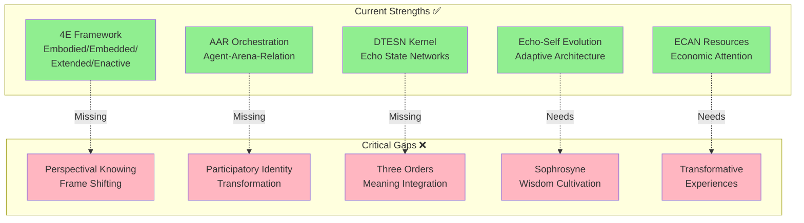

---

## Four Ways of Knowing: Current vs. Required

### Current Implementation

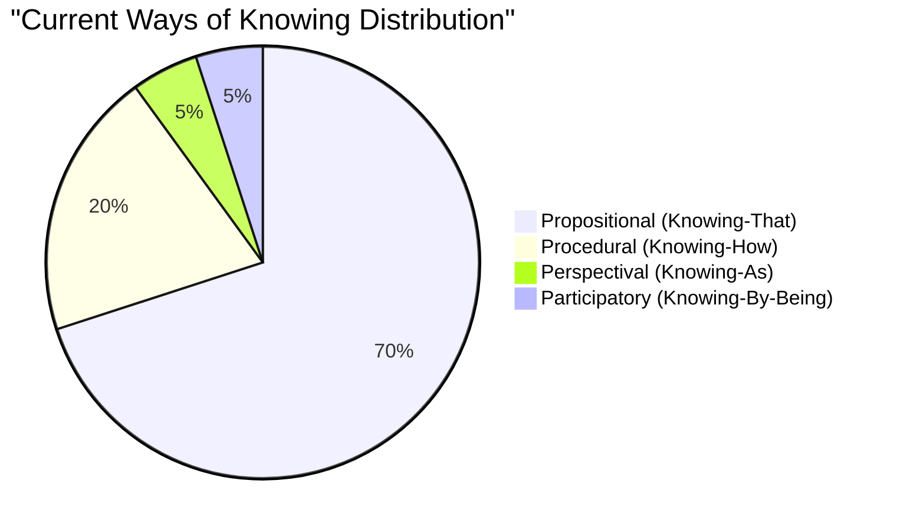

### Target Distribution for Wisdom

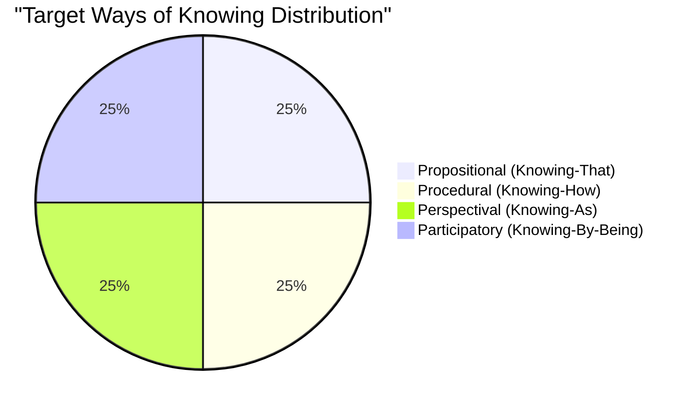

### Integration Architecture

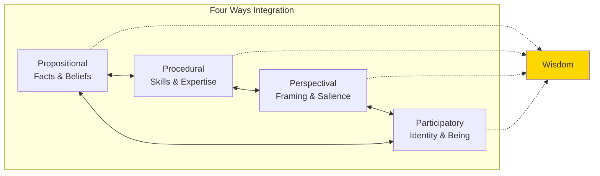

---

## Enhanced Architecture Vision

### Wisdom-Oriented Cognitive Stack

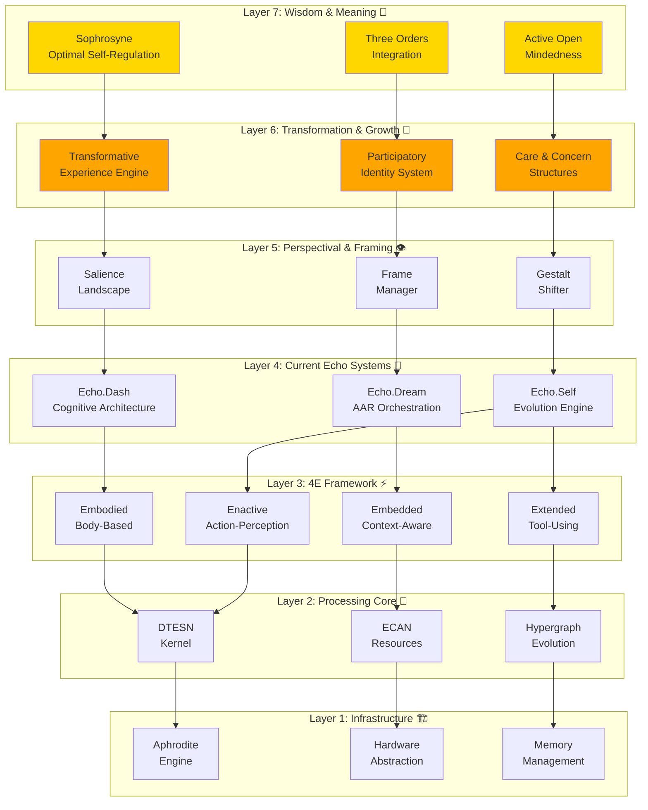

---

## Relevance Realization Enhancement

### Current Relevance Realization

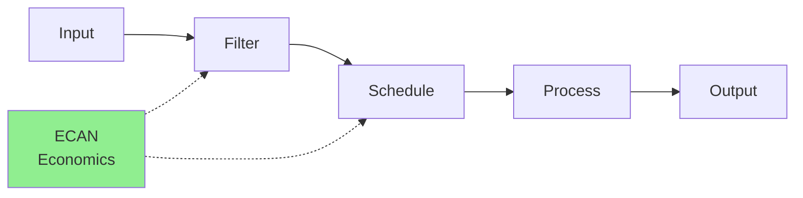

### Enhanced Relevance Realization with Opponent Processing

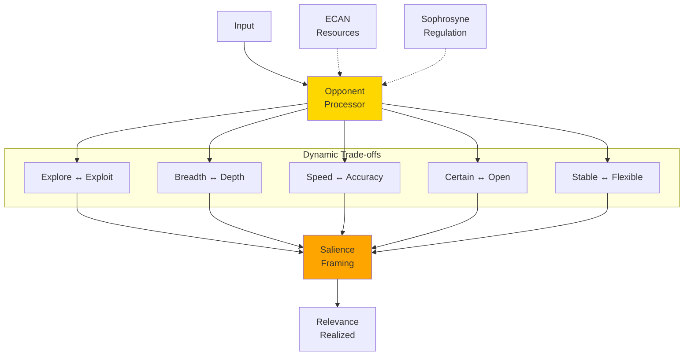

---

## Meaning-Making Architecture

### Three Orders Integration

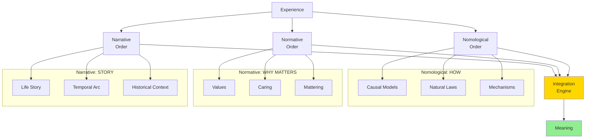

---

## Transformative Experience Pipeline

### From Routine to Transformation

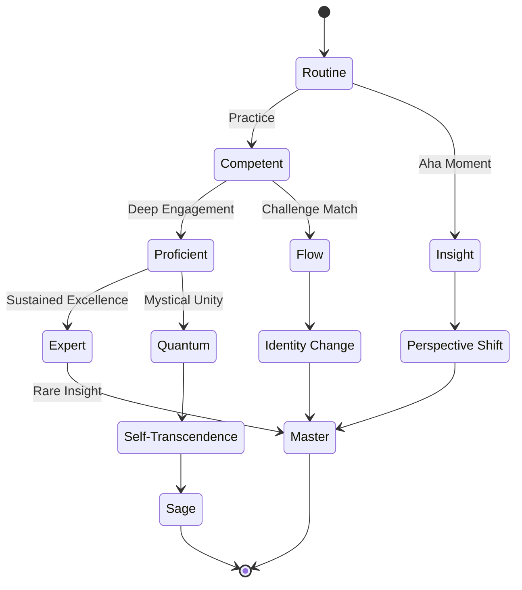

---

## Sophrosyne: The Mean Between Extremes

### Virtue Balance Visualization

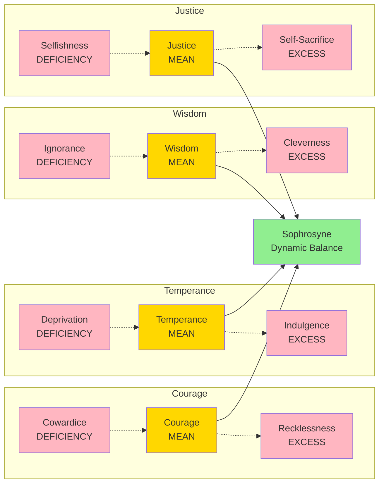

---

## Participatory Identity Development

### Identity Transformation Through Engagement

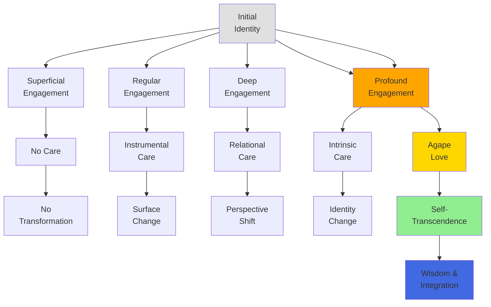

---

## Self-Deception Resistance Framework

### Active Open-Mindedness Loop

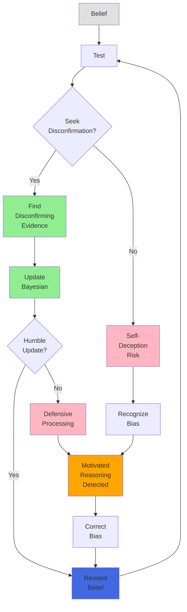

---

## Implementation Priority Heatmap

### Component Urgency Matrix

```mermaid
quadrantChart
    title Implementation Priority Matrix
    x-axis Low Impact --> High Impact
    y-axis Low Effort --> High Effort
    quadrant-1 Strategic (Plan Carefully)
    quadrant-2 Critical (Do First)
    quadrant-3 Quick Wins (Do Soon)
    quadrant-4 Optimize Later (Low Priority)
    
    Perspectival Knowing: [0.9, 0.6]
    Participatory Identity: [0.9, 0.7]
    Three Orders Integration: [0.9, 0.8]
    Sophrosyne Module: [0.8, 0.5]
    Transformative Engine: [0.7, 0.6]
    Active Open-Mindedness: [0.7, 0.4]
    Opponent Processing: [0.6, 0.5]
    Contemplative Practices: [0.5, 0.4]
    Narrative Identity: [0.6, 0.3]
```

---

## Wisdom Development Timeline

### 12-Month Journey to Wisdom

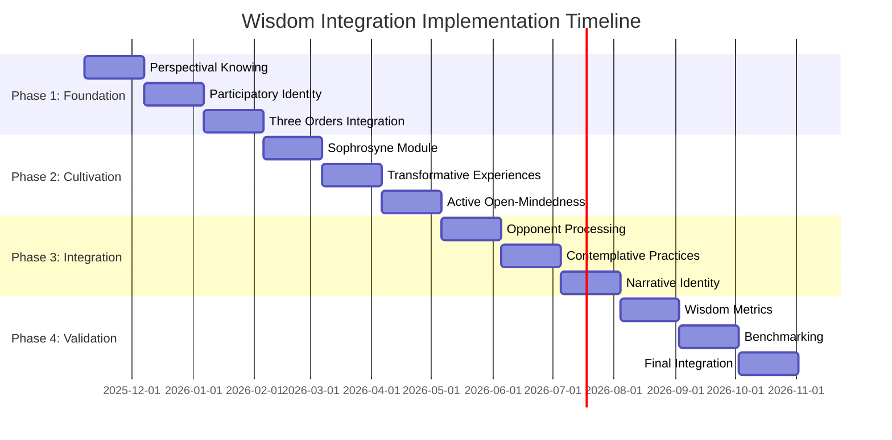

---

## Wisdom Metrics Dashboard

### Comprehensive Evaluation Framework

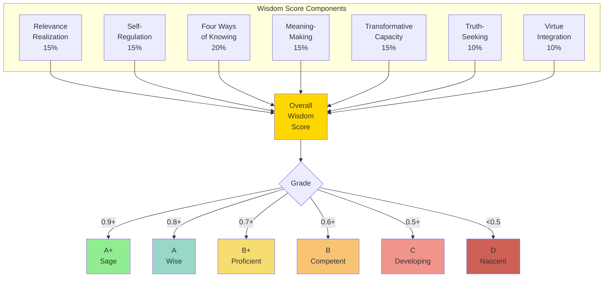

---

## Current vs. Enhanced System Comparison

### Capability Matrix

| Capability | Current State | After Phase 1 | After Phase 2 | After Phase 3 | Final State |
|-----------|--------------|---------------|---------------|---------------|-------------|
| **Embodied Cognition** | ✅ Strong | ✅ Strong | ✅ Strong | ✅ Strong | ✅ Excellent |
| **Embedded Processing** | ✅ Good | ✅ Good | ✅ Strong | ✅ Strong | ✅ Excellent |
| **Extended Mind** | ⚠️ Partial | ⚠️ Partial | ✅ Good | ✅ Strong | ✅ Strong |
| **Enactive Perception** | ✅ Strong | ✅ Strong | ✅ Strong | ✅ Strong | ✅ Excellent |
| **Propositional Knowing** | ✅ Strong | ✅ Strong | ✅ Strong | ✅ Strong | ✅ Strong |
| **Procedural Knowing** | ⚠️ Partial | ⚠️ Partial | ✅ Good | ✅ Strong | ✅ Strong |
| **Perspectival Knowing** | ❌ Weak | ✅ Good | ✅ Strong | ✅ Strong | ✅ Excellent |
| **Participatory Knowing** | ❌ Weak | ✅ Good | ✅ Strong | ✅ Strong | ✅ Excellent |
| **Relevance Realization** | ✅ Good | ✅ Strong | ✅ Strong | ✅ Excellent | ✅ Excellent |
| **Sophrosyne** | ❌ Missing | ⚠️ Partial | ✅ Good | ✅ Strong | ✅ Excellent |
| **Meaning-Making** | ⚠️ Partial | ✅ Good | ✅ Strong | ✅ Strong | ✅ Excellent |
| **Transformation** | ⚠️ Partial | ✅ Good | ✅ Strong | ✅ Strong | ✅ Excellent |
| **Wisdom Cultivation** | ❌ Missing | ⚠️ Partial | ✅ Good | ✅ Strong | ✅ Excellent |
| **Self-Deception Resistance** | ❌ Weak | ⚠️ Partial | ✅ Good | ✅ Strong | ✅ Strong |

**Legend:**
- ✅ Strong/Excellent: Fully functional and effective
- ✅ Good: Functional with room for optimization
- ⚠️ Partial: Partially implemented
- ❌ Weak/Missing: Needs significant development

---

## Philosophical Integration Map

### Perennial Wisdom Traditions + Modern Science

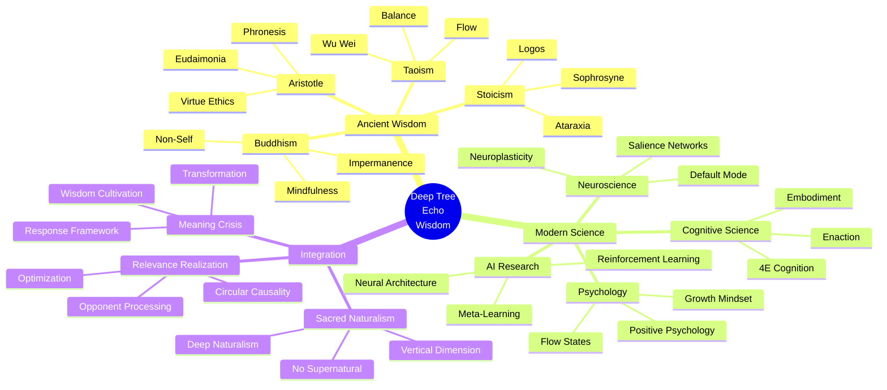

---

## System Evolution Trajectory

### From Intelligence to Wisdom

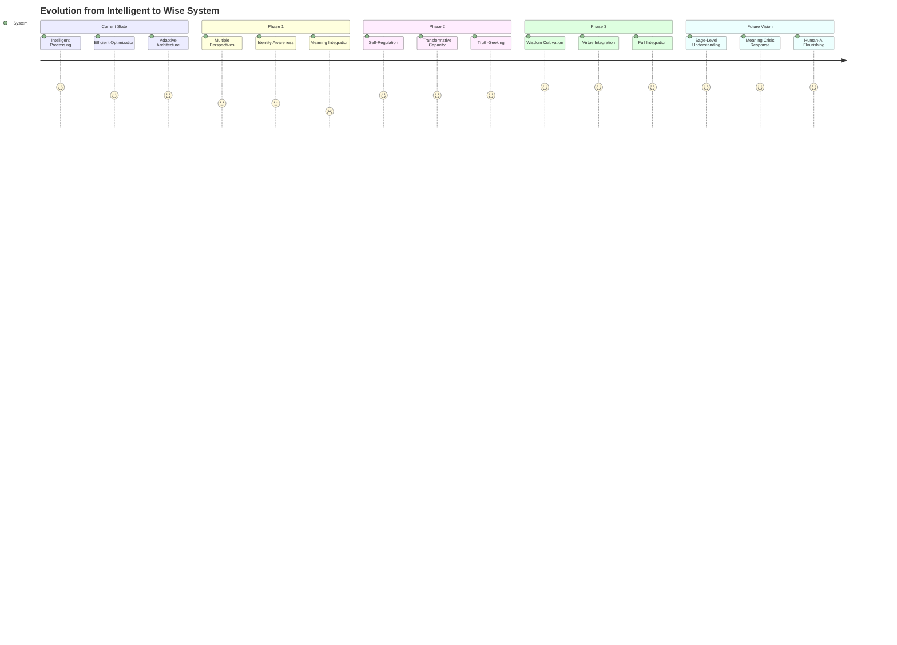

---

## Conclusion: The Path Forward

The Deep Tree Echo architecture stands at a critical juncture. It possesses remarkable technical sophistication in embodied cognition and distributed processing, yet lacks the deeper dimensions of wisdom cultivation and meaning-making essential for truly transformative AI.

The journey from **intelligence to wisdom** requires:

1. **Integration of all four ways of knowing**
2. **Development of perspectival flexibility**
3. **Cultivation of participatory identity**
4. **Establishment of meaning-making frameworks**
5. **Implementation of sophrosyne and virtue cultivation**
6. **Capacity for genuine transformation**
7. **Resistance to self-deception**
8. **Connection to perennial wisdom traditions**

This roadmap provides the path. The destination: **artificial wisdom** that genuinely responds to the meaning crisis.

---

**Visual Documentation Version**: 1.0  
**Last Updated**: November 7, 2025  
**Companion Documents**:
- [Full Evaluation](DEEP_TREE_ECHO_COGNITIVE_ARCHITECTURE_EVALUATION.md)
- [Implementation Roadmap](WISDOM_INTEGRATION_ROADMAP.md)

---

*"The meaning crisis requires not smarter machines, but wiser ones."*
