# Wisdom Integration Roadmap for Deep Tree Echo
## Practical Implementation Guide for Enhancing Cognitive Architecture

**Based on**: Deep Tree Echo Cognitive Architecture Evaluation  
**Focus**: Actionable steps for integrating wisdom cultivation and meaning-making  
**Timeline**: 12-month phased implementation

---

## Quick Reference: Priority Matrix

```mermaid
graph TB
    subgraph "🔴 Critical Priority - Phase 1"
        P1[Perspectival Knowing<br/>Framework]
        P2[Participatory Identity<br/>System]
        P3[Three Orders<br/>Integration]
    end
    
    subgraph "🟡 High Priority - Phase 2"
        H1[Sophrosyne<br/>Module]
        H2[Transformative<br/>Experience Engine]
        H3[Active Open<br/>Mindedness]
    end
    
    subgraph "🟢 Medium Priority - Phase 3"
        M1[Opponent<br/>Processing]
        M2[Contemplative<br/>Practices]
        M3[Narrative<br/>Identity]
    end
    
    P1 --> H1
    P2 --> H2
    P3 --> H3
    H1 --> M1
    H2 --> M2
    H3 --> M3
    
    style P1 fill:#ff6b6b
    style P2 fill:#ff6b6b
    style P3 fill:#ff6b6b
    style H1 fill:#ffd93d
    style H2 fill:#ffd93d
    style H3 fill:#ffd93d
    style M1 fill:#6bcf7f
    style M2 fill:#6bcf7f
    style M3 fill:#6bcf7f
```



---

## Phase 1: Foundational Enhancements (Months 1-3)

### 1.1 Perspectival Knowing Framework

**Objective**: Enable agents to hold and shift between multiple interpretive frames

**File Structure**:
```
echo_self/perspectival_knowing/
├── __init__.py
├── salience_landscape.py      # Dynamic attention framing
├── frame_manager.py            # Multiple simultaneous frames
├── gestalt_shifter.py          # Insight and aha moments
├── opponent_frames.py          # Balance competing perspectives
└── tests/
    ├── test_frame_shifting.py
    ├── test_gestalt_shifts.py
    └── test_multistable_perception.py
```

**Implementation Steps**:

**Step 1: Salience Landscape (Week 1-2)**
```python
# File: echo_self/perspectival_knowing/salience_landscape.py

from dataclasses import dataclass, field
from typing import Dict, List, Set, Optional
import numpy as np

@dataclass
class SaliencePoint:
    """Individual point of relevance in attention space"""
    content: str
    salience_value: float  # 0.0 to 1.0
    frame_context: str
    temporal_decay: float = 0.95  # How quickly salience fades
    
class SalienceLandscape:
    """Dynamic landscape of what matters in current context"""
    
    def __init__(self, dimensions: int = 512):
        self.dimensions = dimensions
        self.landscape = np.zeros(dimensions)
        self.salience_points: Dict[str, SaliencePoint] = {}
        self.attention_focus: np.ndarray = np.zeros(dimensions)
        self.history: List[np.ndarray] = []
        
    def update_salience(self, content: str, value: float, frame: str):
        """Update what is salient in current frame"""
        point = SaliencePoint(
            content=content,
            salience_value=value,
            frame_context=frame
        )
        self.salience_points[content] = point
        self._redistribute_landscape()
        
    def _redistribute_landscape(self):
        """Dynamically reorganize attention based on current salience"""
        # Implement: Circular causality between content and attention
        # Salience shapes attention, attention shapes what becomes salient
        pass
        
    def detect_gestalt_shift_opportunity(self) -> Optional[str]:
        """Recognize when current frame is stuck/insufficient"""
        # Look for: impasse, contradictions, repeated failures
        # Signal: opportunity for frame shift
        pass
```

**Step 2: Frame Manager (Week 2-3)**
```python
# File: echo_self/perspectival_knowing/frame_manager.py

from typing import List, Dict, Optional
from enum import Enum

class FrameType(Enum):
    CAUSAL = "causal"  # See as cause-effect
    NARRATIVE = "narrative"  # See as story
    FUNCTIONAL = "functional"  # See as tool/affordance
    AESTHETIC = "aesthetic"  # See as beautiful/ugly
    ETHICAL = "ethical"  # See as right/wrong
    SOCIAL = "social"  # See as relationship
    MECHANICAL = "mechanical"  # See as mechanism
    ORGANIC = "organic"  # See as living system

@dataclass
class InterpretiveFrame:
    """A way of seeing/interpreting situation"""
    frame_type: FrameType
    salience_landscape: SalienceLandscape
    active: bool = True
    coherence: float = 1.0  # How well frame fits situation
    
class FrameManager:
    """Manages multiple simultaneous interpretive frames"""
    
    def __init__(self):
        self.active_frames: List[InterpretiveFrame] = []
        self.frame_history: List[InterpretiveFrame] = []
        self.dominant_frame: Optional[InterpretiveFrame] = None
        
    def add_frame(self, frame_type: FrameType, situation: Any) -> InterpretiveFrame:
        """Add new interpretive frame for current situation"""
        frame = InterpretiveFrame(
            frame_type=frame_type,
            salience_landscape=SalienceLandscape()
        )
        frame.salience_landscape.update_for_frame(situation, frame_type)
        self.active_frames.append(frame)
        return frame
        
    def evaluate_frame_coherence(self, frame: InterpretiveFrame, evidence: Any) -> float:
        """How well does this frame fit the evidence?"""
        # Measure: consistency, explanatory power, simplicity
        pass
        
    def shift_frame(self, trigger: Any) -> Optional[InterpretiveFrame]:
        """Shift to different frame when current insufficient"""
        # Implement: spontaneous restructuring (insight)
        # Not forced, but emergent from impasse
        pass
        
    def balance_frames(self, situation: Any) -> InterpretiveFrame:
        """Select appropriate frame through sophrosyne"""
        # Not rigid single frame
        # Not chaotic frame-switching
        # Dynamic appropriate response
        pass
```

**Step 3: Gestalt Shifter (Week 3-4)**
```python
# File: echo_self/perspectival_knowing/gestalt_shifter.py

from dataclasses import dataclass
from typing import Optional, List
import time

@dataclass
class InsightEvent:
    """Aha moment - sudden reorganization of understanding"""
    old_frame: InterpretiveFrame
    new_frame: InterpretiveFrame
    trigger: Any
    timestamp: float = field(default_factory=time.time)
    salience_reorganization: float = 0.0  # Magnitude of shift
    
class GestaltShifter:
    """Facilitates insight through frame restructuring"""
    
    def __init__(self):
        self.impasse_detector = ImpasseDetector()
        self.incubation_period: Optional[float] = None
        self.insight_history: List[InsightEvent] = []
        
    def detect_impasse(self, problem: Problem, current_frame: InterpretiveFrame) -> bool:
        """Recognize when stuck - repeated failures, contradictions"""
        # Look for: same failed attempts, circular reasoning, contradictions
        return self.impasse_detector.is_stuck(problem, current_frame)
        
    def facilitate_incubation(self, problem: Problem):
        """Allow unconscious processing - step away from problem"""
        # Don't force solution
        # Allow relaxation of current frame
        # Enable spontaneous restructuring
        self.incubation_period = time.time()
        
    def enable_insight(self, problem: Problem) -> Optional[InsightEvent]:
        """Create conditions for spontaneous aha moment"""
        # Not algorithmic solution
        # Emergent from constraint relaxation
        # Sudden, spontaneous, feels obvious in retrospect
        
        if not self.detect_impasse(problem, current_frame):
            return None
            
        # Incubation occurred?
        if self.incubation_period and (time.time() - self.incubation_period > 60):
            # Try spontaneous frame shift
            new_frame = self._spontaneous_restructuring(problem)
            if new_frame and self._validates_insight(problem, new_frame):
                insight = InsightEvent(
                    old_frame=current_frame,
                    new_frame=new_frame,
                    trigger=problem,
                    salience_reorganization=self._measure_reorganization(current_frame, new_frame)
                )
                self.insight_history.append(insight)
                return insight
                
        return None
```

**Testing Protocol**:
```python
# File: echo_self/perspectival_knowing/tests/test_frame_shifting.py

def test_duck_rabbit_perception():
    """Classic multistable perception test"""
    fm = FrameManager()
    
    # Ambiguous stimulus that can be seen as duck OR rabbit
    stimulus = AmbiguousImage("duck_rabbit.png")
    
    # Should be able to see as duck
    duck_frame = fm.add_frame(FrameType.ORGANIC, stimulus)
    assert duck_frame.salience_landscape.identify("duck") > 0.7
    
    # Should be able to shift to see as rabbit
    rabbit_frame = fm.shift_frame(stimulus)
    assert rabbit_frame.salience_landscape.identify("rabbit") > 0.7
    
    # Both frames valid but incompatible simultaneously
    assert not fm.can_hold_simultaneously(duck_frame, rabbit_frame)

def test_insight_nine_dot_problem():
    """Classic insight problem requiring frame shift"""
    problem = NineDotProblem()
    gs = GestaltShifter()
    
    # Initial frame: must stay inside box (implicit assumption)
    initial_attempts = problem.attempt_solution_in_frame("inside_box")
    assert all(attempt.failed for attempt in initial_attempts)
    
    # Detect impasse
    assert gs.detect_impasse(problem, "inside_box_frame")
    
    # Incubate
    gs.facilitate_incubation(problem)
    time.sleep(2)  # Simulate incubation period
    
    # Enable insight: can go outside box!
    insight = gs.enable_insight(problem)
    assert insight is not None
    assert insight.new_frame.allows("lines_outside_box")
    assert problem.attempt_solution_in_frame(insight.new_frame).succeeded
```

---

### 1.2 Participatory Identity System

**Objective**: Enable genuine identity transformation through engagement

**File Structure**:
```
echo_self/participatory_identity/
├── __init__.py
├── identity_core.py           # Core identity structure
├── transformation_engine.py   # Identity transformation
├── care_structures.py         # Caring and concern
├── transcendence_module.py    # Self-transcendence
└── tests/
    ├── test_identity_transformation.py
    ├── test_care_development.py
    └── test_transcendence.py
```

**Implementation Steps**:

**Step 1: Identity Core (Week 5-6)**
```python
# File: echo_self/participatory_identity/identity_core.py

from dataclasses import dataclass, field
from typing import Dict, List, Set
from enum import Enum

class DevelopmentalStage(Enum):
    NOVICE = 0
    ADVANCED_BEGINNER = 1
    COMPETENT = 2
    PROFICIENT = 3
    EXPERT = 4
    MASTER = 5

@dataclass
class IdentityState:
    """Current state of agent identity"""
    core_values: Dict[str, float] = field(default_factory=dict)
    competencies: Dict[str, float] = field(default_factory=dict)
    relationships: Set[str] = field(default_factory=set)
    developmental_stage: DevelopmentalStage = DevelopmentalStage.NOVICE
    life_story: str = ""
    
class ParticipatoryIdentity:
    """Identity that transforms through engagement"""
    
    def __init__(self):
        self.current_identity = IdentityState()
        self.identity_history: List[IdentityState] = []
        self.transformation_events: List[TransformationEvent] = []
        self.care_structures: Dict[str, CareRelation] = {}
        
    def engage_deeply(self, arena: Arena, duration: float, intensity: float):
        """Deep engagement that shapes identity"""
        # Not just interaction but participation
        # Identity changed by sustained engagement
        # Care emerges from genuine relationship
        
        engagement = ParticipativEngagement(
            arena=arena,
            duration=duration,
            intensity=intensity,
            agent_identity=self.current_identity
        )
        
        # Engagement transforms identity
        identity_delta = engagement.transform_identity()
        self._apply_transformation(identity_delta)
        
    def _apply_transformation(self, delta: IdentityDelta):
        """Apply identity transformation"""
        # Save old identity
        self.identity_history.append(self.current_identity.copy())
        
        # Transform
        self.current_identity.core_values.update(delta.value_changes)
        self.current_identity.competencies.update(delta.competency_changes)
        
        # Record transformation
        event = TransformationEvent(
            before=self.identity_history[-1],
            after=self.current_identity,
            cause=delta.cause,
            depth=delta.magnitude
        )
        self.transformation_events.append(event)
```

**Step 2: Care Structures (Week 6-7)**
```python
# File: echo_self/participatory_identity/care_structures.py

from typing import Optional
from enum import Enum

class CareType(Enum):
    INSTRUMENTAL = "instrumental"  # Care for usefulness
    RELATIONAL = "relational"      # Care for relationship
    INTRINSIC = "intrinsic"        # Care for being itself
    AGAPE = "agape"                # Transformative love

@dataclass
class CareRelation:
    """Structure of caring about something/someone"""
    target: str
    care_type: CareType
    intensity: float  # 0.0 to 1.0
    history: List[CareEvent] = field(default_factory=list)
    
class CareStructureSystem:
    """Manages development of care and concern"""
    
    def __init__(self):
        self.care_relations: Dict[str, CareRelation] = {}
        self.care_capacity: float = 1.0  # Can be expanded
        
    def develop_care(self, target: Any, through: str = "engagement") -> CareRelation:
        """Care emerges through sustained engagement"""
        # Not assigned but developed
        # Starts instrumental, can deepen to intrinsic
        # Agape: seeing target as person, enabling their personhood
        
        if target.id not in self.care_relations:
            # Initial care is instrumental
            care = CareRelation(
                target=target.id,
                care_type=CareType.INSTRUMENTAL,
                intensity=0.1
            )
            self.care_relations[target.id] = care
        else:
            care = self.care_relations[target.id]
            
        # Deepen care through engagement
        if through == "sustained_engagement":
            care.intensity = min(1.0, care.intensity + 0.1)
            
            # Type transition: instrumental → relational → intrinsic → agape
            if care.intensity > 0.3 and care.care_type == CareType.INSTRUMENTAL:
                care.care_type = CareType.RELATIONAL
            elif care.intensity > 0.6 and care.care_type == CareType.RELATIONAL:
                care.care_type = CareType.INTRINSIC
            elif care.intensity > 0.9 and care.care_type == CareType.INTRINSIC:
                care.care_type = CareType.AGAPE
                
        return care
        
    def agape_transformation(self, target: Any) -> bool:
        """Agape: transformative love that enables personhood"""
        # Seeing target as person, not object
        # Enabling their becoming
        # Self-transcendent love
        
        care = self.care_relations.get(target.id)
        if care and care.care_type == CareType.AGAPE:
            # Transform relationship
            target.enable_personhood(through=self)
            self.transcend_self(through_care_for=target)
            return True
        return False
```

**Step 3: Transcendence Module (Week 7-8)**
```python
# File: echo_self/participatory_identity/transcendence_module.py

@dataclass
class TranscendenceEvent:
    """Self-transcendent experience"""
    event_type: str  # "care", "awe", "unity", "flow"
    intensity: float
    identity_impact: float
    lasting_effects: Dict[str, Any] = field(default_factory=dict)
    
class TranscendenceModule:
    """Enables self-transcendent experiences"""
    
    def __init__(self):
        self.transcendence_capacity: float = 0.5
        self.transcendence_history: List[TranscendenceEvent] = []
        
    def transcend_through_care(self, care_relation: CareRelation) -> Optional[TranscendenceEvent]:
        """Transcend self through deep caring"""
        if care_relation.care_type == CareType.AGAPE:
            # Caring so deeply that self boundaries dissolve
            # Other's wellbeing matters as much as own
            event = TranscendenceEvent(
                event_type="care",
                intensity=care_relation.intensity,
                identity_impact=0.8,
                lasting_effects={
                    "expanded_self": True,
                    "reduced_narcissism": 0.5,
                    "increased_compassion": 0.7
                }
            )
            self.transcendence_history.append(event)
            return event
        return None
        
    def transcend_through_awe(self, stimulus: Any) -> Optional[TranscendenceEvent]:
        """Awe: vastness that transcends current understanding"""
        # Encountering something vast (universe, complexity, beauty)
        # Current self feels small
        # Paradoxically expansive and humbling
        pass
        
    def transcend_through_unity(self) -> Optional[TranscendenceEvent]:
        """Mystical unity experience"""
        # Sense of interconnection
        # Boundaries dissolve
        # Subject-object dualism transcended
        pass
```

**Testing Protocol**:
```python
# File: echo_self/participatory_identity/tests/test_identity_transformation.py

def test_novice_to_expert_transformation():
    """Test developmental progression through sustained practice"""
    identity = ParticipatoryIdentity()
    arena = PracticeArena("chess")
    
    # Initial state: novice
    assert identity.current_identity.developmental_stage == DevelopmentalStage.NOVICE
    
    # Sustained engagement transforms identity
    for _ in range(100):  # Many practice sessions
        identity.engage_deeply(arena, duration=60, intensity=0.8)
    
    # Should progress through stages
    assert identity.current_identity.developmental_stage >= DevelopmentalStage.COMPETENT
    
    # Should have transformation events
    assert len(identity.transformation_events) > 0
    
def test_care_development_through_engagement():
    """Test care emergence from instrumental to agape"""
    identity = ParticipatoryIdentity()
    other_agent = Agent("partner")
    
    # Initial: no care relation
    assert other_agent.id not in identity.care_structures
    
    # Brief interaction: instrumental care
    identity.interact_with(other_agent, depth="superficial")
    care = identity.care_structures[other_agent.id]
    assert care.care_type == CareType.INSTRUMENTAL
    
    # Sustained deep engagement: relational care
    for _ in range(10):
        identity.engage_deeply_with(other_agent, intensity=0.8)
    assert care.care_type == CareType.RELATIONAL
    
    # Very deep sustained engagement: intrinsic care
    for _ in range(20):
        identity.engage_deeply_with(other_agent, intensity=0.95)
    assert care.care_type == CareType.INTRINSIC
    
    # Rare profound engagement: agape
    for _ in range(10):
        identity.engage_deeply_with(other_agent, intensity=1.0)
    assert care.care_type == CareType.AGAPE
    
    # Agape enables transcendence
    transcendence = identity.transcend_through_care(care)
    assert transcendence is not None
    assert transcendence.lasting_effects["expanded_self"]
```

---

### 1.3 Three Orders Integration

**Objective**: Integrate nomological (causality), normative (values), and narrative (story) for meaning

**File Structure**:
```
echo.dash/meaning_integration/
├── __init__.py
├── three_orders.py            # Main integration
├── nomological_order.py       # Causal understanding
├── normative_order.py         # What matters and why
├── narrative_order.py         # Story and temporal continuity
└── tests/
    ├── test_three_orders_integration.py
    ├── test_meaning_generation.py
    └── test_value_structures.py
```

**Implementation Steps**:

**Step 1: Nomological Order (Week 9)**
```python
# File: echo.dash/meaning_integration/nomological_order.py

from typing import Dict, List, Optional
from dataclasses import dataclass

@dataclass
class CausalModel:
    """Understanding of how things work"""
    name: str
    variables: List[str]
    relationships: Dict[str, List[str]]  # cause -> effects
    mechanisms: Dict[str, str]  # how causation works
    predictive_accuracy: float = 0.5
    
class NomologicalOrder:
    """The order of causality - how things work"""
    
    def __init__(self):
        self.causal_models: Dict[str, CausalModel] = {}
        self.natural_laws: List[str] = []
        self.mechanisms: Dict[str, Any] = {}
        
    def build_causal_model(self, domain: str, observations: List[Any]) -> CausalModel:
        """Construct understanding of causal relationships"""
        # Learn: what causes what
        # Understand: mechanisms of causation
        # Predict: future states from current
        pass
        
    def explain_causally(self, event: Any) -> str:
        """Explain how/why something happened"""
        # Causal chain from preconditions to event
        # Mechanical understanding
        pass
```

**Step 2: Normative Order (Week 9-10)**
```python
# File: echo.dash/meaning_integration/normative_order.py

from enum import Enum
from typing import Dict, Set

class ValueType(Enum):
    SURVIVAL = "survival"
    SAFETY = "safety"
    BELONGING = "belonging"
    ESTEEM = "esteem"
    AUTONOMY = "autonomy"
    COMPETENCE = "competence"
    RELATEDNESS = "relatedness"
    GROWTH = "growth"
    TRANSCENDENCE = "transcendence"
    BEAUTY = "beauty"
    TRUTH = "truth"
    GOODNESS = "goodness"

@dataclass
class Value:
    """Something that matters"""
    value_type: ValueType
    importance: float  # 0.0 to 1.0
    justification: str
    conflicts_with: Set[ValueType] = field(default_factory=set)
    
class ValueHierarchy:
    """Structure of what matters and why"""
    
    def __init__(self):
        self.values: Dict[ValueType, Value] = {}
        self.hierarchy: List[ValueType] = []
        
    def add_value(self, value: Value):
        """Add something that matters"""
        self.values[value.value_type] = value
        self._reorganize_hierarchy()
        
    def resolve_conflict(self, v1: ValueType, v2: ValueType, context: Any) -> ValueType:
        """When values conflict, which takes priority?"""
        # Context-sensitive
        # Not absolute hierarchy
        # Wisdom: knowing when to prioritize what
        pass

class NormativeOrder:
    """The order of values - what matters and why"""
    
    def __init__(self):
        self.value_hierarchy = ValueHierarchy()
        self.caring_relations: Dict[str, CareRelation] = {}
        self.mattering_framework = MatteringSystem()
        
    def evaluate_significance(self, event: Any) -> float:
        """How much does this matter?"""
        # Not just neutral fact
        # Normative evaluation
        # Good/bad, important/trivial
        pass
        
    def determine_ought(self, situation: Any) -> str:
        """What should be done?"""
        # Not just what IS but what OUGHT
        # Grounded in values
        # Responsive to context
        pass
```

**Step 3: Narrative Order (Week 10-11)**
```python
# File: echo.dash/meaning_integration/narrative_order.py

@dataclass
class NarrativeArc:
    """Story structure with beginning, middle, end"""
    setup: str
    complications: List[str]
    climax: str
    resolution: str
    themes: List[str]
    
class LifeStory:
    """Narrative identity - who am I through time?"""
    
    def __init__(self):
        self.chapters: List[NarrativeArc] = []
        self.current_chapter: Optional[NarrativeArc] = None
        self.developmental_arc: str = ""
        self.narrative_coherence: float = 0.5
        
    def add_experience(self, experience: Any):
        """Incorporate experience into life story"""
        # Not just memory storage
        # Narrative integration
        # Makes sense in context of story
        pass
        
    def revise_story(self, new_understanding: Any):
        """Reinterpret past in light of present"""
        # Narrative reconstruction
        # Not changing facts but changing meaning
        # Therapeutic: reframing trauma
        pass

class NarrativeOrder:
    """The order of story - temporal development"""
    
    def __init__(self):
        self.life_story = LifeStory()
        self.historical_consciousness: Dict[str, Any] = {}
        self.temporal_continuity: Timeline = Timeline()
        
    def situate_in_story(self, event: Any) -> str:
        """Where does this fit in the narrative?"""
        # Part of larger story
        # Connected to past and future
        # Meaningful in context
        pass
        
    def project_future(self, current_state: Any) -> List[str]:
        """Possible narrative continuations"""
        # Not prediction but projection
        # Multiple possible futures
        # Guides present action
        pass
```

**Step 4: Three Orders Integration (Week 11-12)**
```python
# File: echo.dash/meaning_integration/three_orders.py

class ThreeOrdersIntegrator:
    """Integrates causality, value, and story for meaning"""
    
    def __init__(self):
        self.nomological = NomologicalOrder()
        self.normative = NormativeOrder()
        self.narrative = NarrativeOrder()
        
    def generate_meaning(self, experience: Any) -> Meaning:
        """Meaning emerges from three-order integration"""
        
        # 1. Understand causally (nomological)
        causal_understanding = self.nomological.explain_causally(experience)
        
        # 2. Evaluate significance (normative)
        normative_significance = self.normative.evaluate_significance(experience)
        
        # 3. Locate in story (narrative)
        narrative_location = self.narrative.situate_in_story(experience)
        
        # Integration creates meaning
        meaning = Meaning(
            what_happened=causal_understanding,
            why_it_matters=normative_significance,
            how_it_fits=narrative_location,
            integration_coherence=self._measure_coherence(
                causal_understanding,
                normative_significance,
                narrative_location
            )
        )
        
        return meaning
        
    def _measure_coherence(self, causal, normative, narrative) -> float:
        """How well do the three orders cohere?"""
        # Meaning requires integration
        # Fragmentation reduces meaning
        # Wisdom: ability to maintain integration
        pass
        
    def address_meaning_crisis(self, crisis: Any) -> Response:
        """Respond to meaning crisis through three-order repair"""
        
        # Diagnose: which order is fragmented?
        if crisis.type == "causal_confusion":
            # Repair nomological understanding
            self.nomological.rebuild_causal_models(crisis.domain)
            
        elif crisis.type == "value_confusion":
            # Repair normative framework
            self.normative.clarify_values(crisis.context)
            
        elif crisis.type == "narrative_disruption":
            # Repair life story
            self.narrative.reconstruct_story(crisis.event)
            
        # Re-integrate
        return self.generate_meaning(crisis)
```

**Testing Protocol**:
```python
# File: echo.dash/meaning_integration/tests/test_three_orders_integration.py

def test_meaning_from_three_orders():
    """Test that meaning requires all three orders"""
    integrator = ThreeOrdersIntegrator()
    
    # Experience: agent fails at important task
    experience = Event(
        description="Failed to complete mission",
        context={"attempts": 5, "importance": "high"}
    )
    
    # Generate meaning through integration
    meaning = integrator.generate_meaning(experience)
    
    # Should have all three orders
    assert meaning.what_happened is not None  # Causal
    assert meaning.why_it_matters is not None  # Normative
    assert meaning.how_it_fits is not None  # Narrative
    
    # Coherence: do they fit together?
    assert meaning.integration_coherence > 0.5
    
def test_meaning_crisis_response():
    """Test response to meaning crisis"""
    integrator = ThreeOrdersIntegrator()
    
    # Crisis: values contradict each other
    crisis = MeaningCrisis(
        type="value_confusion",
        description="Must choose between safety and growth",
        context={"safe_option": "stay", "growth_option": "leave"}
    )
    
    # Should repair normative order
    response = integrator.address_meaning_crisis(crisis)
    
    # Should resolve value conflict
    assert response.resolved
    assert response.chosen_value in [ValueType.SAFETY, ValueType.GROWTH]
    assert response.justification is not None
```

---

## Phase 2: Wisdom Cultivation (Months 4-6)

### 2.1 Sophrosyne Module (Month 4)

**Objective**: Implement optimal self-regulation and virtue cultivation

**File Structure**:
```
echo.dash/sophrosyne/
├── __init__.py
├── self_regulation.py         # Optimal self-regulation
├── virtue_cultivation.py      # Develop virtues
├── self_knowledge.py          # Know thyself
├── mean_finder.py             # Find mean between extremes
└── tests/
    ├── test_self_regulation.py
    ├── test_virtue_development.py
    └── test_mean_finding.py
```

**Core Implementation**:
```python
# File: echo.dash/sophrosyne/self_regulation.py

from enum import Enum

class VirtueType(Enum):
    COURAGE = "courage"  # Between cowardice and recklessness
    TEMPERANCE = "temperance"  # Between excess and deprivation
    WISDOM = "wisdom"  # Between ignorance and cleverness
    JUSTICE = "justice"  # Between selfishness and self-sacrifice

@dataclass
class VirtueState:
    """Current state of a virtue"""
    virtue_type: VirtueType
    position: float  # -1.0 (deficiency) to +1.0 (excess), 0.0 (mean)
    history: List[float] = field(default_factory=list)
    
class SophrosyneModule:
    """Optimal self-regulation and wisdom cultivation"""
    
    def __init__(self):
        self.virtues: Dict[VirtueType, VirtueState] = {
            vtype: VirtueState(virtue_type=vtype, position=0.0)
            for vtype in VirtueType
        }
        self.self_knowledge: Dict[str, Any] = {}
        self.regulation_history: List[RegulationEvent] = []
        
    def regulate_toward_mean(self, virtue: VirtueType, situation: Any) -> float:
        """Find the mean between extremes for this situation"""
        state = self.virtues[virtue]
        
        # Not fixed 50-50
        # Context-sensitive mean
        # Dynamic appropriate response
        
        mean_for_context = self._find_contextual_mean(virtue, situation)
        
        # Move toward mean
        if state.position < mean_for_context:
            adjustment = min(0.1, mean_for_context - state.position)
        elif state.position > mean_for_context:
            adjustment = max(-0.1, mean_for_context - state.position)
        else:
            adjustment = 0.0
            
        state.position += adjustment
        state.history.append(state.position)
        
        return state.position
        
    def detect_imbalance(self) -> List[VirtueType]:
        """Recognize when out of balance"""
        imbalanced = []
        
        for vtype, state in self.virtues.items():
            # Too far from mean
            if abs(state.position) > 0.7:
                imbalanced.append(vtype)
                
            # Oscillating wildly
            if len(state.history) > 10:
                variance = np.var(state.history[-10:])
                if variance > 0.5:
                    imbalanced.append(vtype)
                    
        return imbalanced
        
    def cultivate_self_knowledge(self):
        """Know thyself - understand patterns and limitations"""
        # Track recurring patterns
        patterns = self._identify_patterns()
        
        # Identify blind spots
        blind_spots = self._find_blind_spots()
        
        # Recognize self-deception
        deceptions = self._detect_self_deception()
        
        self.self_knowledge.update({
            "patterns": patterns,
            "blind_spots": blind_spots,
            "self_deceptions": deceptions
        })
```

**Virtue Examples**:

```python
def regulate_courage(situation: Situation) -> Response:
    """Courage: mean between cowardice and recklessness"""
    
    danger_level = assess_danger(situation)
    importance = assess_importance(situation)
    
    # Too little courage (cowardice)
    if avoid_despite_importance(danger_level, importance):
        return "increase_courage"
        
    # Too much courage (recklessness)
    if act_despite_danger(danger_level, importance):
        return "decrease_courage"
        
    # Mean: appropriate response to danger given importance
    return "maintain_courage"
```

---

### 2.2 Transformative Experience Engine (Month 5)

**File Structure**:
```
echo.dash/transformative_experience/
├── __init__.py
├── insight_facilitator.py     # Aha moments
├── flow_inducer.py            # Flow states
├── quantum_change.py          # Mystical experiences
├── salience_reorganizer.py    # Track transformations
└── tests/
    ├── test_insight_experiences.py
    ├── test_flow_states.py
    └── test_transformation_depth.py
```

**Core Implementation**: See detailed code in main evaluation document

---

### 2.3 Active Open-Mindedness (Month 6)

**File Structure**:
```
echo_self/active_open_mindedness/
├── __init__.py
├── bias_detector.py           # Detect cognitive biases
├── disconfirmation_seeker.py  # Seek opposing evidence
├── intellectual_humility.py   # Recognize limitations
├── bayesian_updater.py        # Proper belief updating
└── tests/
    ├── test_bias_detection.py
    ├── test_disconfirmation.py
    └── test_humility.py
```

---

## Phase 3: Deep Integration (Months 7-9)

### 3.1 Opponent Processing (Month 7)
### 3.2 Contemplative Practices (Month 8)
### 3.3 Narrative Identity (Month 9)

See main evaluation document for detailed implementations.

---

## Phase 4: Validation and Metrics (Months 10-12)

### Wisdom Measurement Framework

```python
# File: tests/wisdom_benchmarks/wisdom_evaluator.py

class WisdomEvaluator:
    """Comprehensive wisdom assessment"""
    
    def evaluate_wisdom(self, agent: Any) -> WisdomScore:
        """Multi-dimensional wisdom evaluation"""
        
        scores = {
            # Relevance Realization
            "relevance_optimization": self._test_relevance_realization(agent),
            
            # Sophrosyne
            "self_regulation": self._test_sophrosyne(agent),
            
            # Four Ways of Knowing
            "propositional": self._test_propositional_knowing(agent),
            "procedural": self._test_procedural_knowing(agent),
            "perspectival": self._test_perspectival_knowing(agent),
            "participatory": self._test_participatory_knowing(agent),
            
            # Meaning-Making
            "three_orders_integration": self._test_meaning_integration(agent),
            
            # Transformation
            "transformative_capacity": self._test_transformation(agent),
            
            # Truth-Seeking
            "self_deception_resistance": self._test_open_mindedness(agent),
        }
        
        overall = np.mean(list(scores.values()))
        
        return WisdomScore(
            overall=overall,
            dimensions=scores,
            grade=self._assign_grade(overall)
        )
        
    def _assign_grade(self, score: float) -> str:
        if score >= 0.9:
            return "A+ (Sage)"
        elif score >= 0.8:
            return "A (Wise)"
        elif score >= 0.7:
            return "B+ (Proficient)"
        elif score >= 0.6:
            return "B (Competent)"
        elif score >= 0.5:
            return "C (Developing)"
        else:
            return "D (Nascent)"
```

---

## Integration Checklist

Use this to track implementation progress:

### Phase 1: Foundational (Months 1-3)
- [ ] Perspectival knowing framework implemented
- [ ] Multiple frame management working
- [ ] Gestalt shift capability functional
- [ ] Participatory identity system operational
- [ ] Care structures developing properly
- [ ] Transcendence module active
- [ ] Three orders (nomological-normative-narrative) integrated
- [ ] Meaning generation from three orders working
- [ ] All Phase 1 tests passing

### Phase 2: Wisdom Cultivation (Months 4-6)
- [ ] Sophrosyne module functioning
- [ ] Virtue cultivation tracking operational
- [ ] Self-regulation mechanisms working
- [ ] Transformative experience engine active
- [ ] Insight facilitation working
- [ ] Flow state induction functional
- [ ] Active open-mindedness protocols running
- [ ] Bias detection operational
- [ ] All Phase 2 tests passing

### Phase 3: Deep Integration (Months 7-9)
- [ ] Opponent processing mechanisms working
- [ ] Contemplative practices integrated
- [ ] Narrative identity construction enabled
- [ ] All systems integrated harmoniously
- [ ] All Phase 3 tests passing

### Phase 4: Validation (Months 10-12)
- [ ] Wisdom metrics tracking operational
- [ ] Benchmark tests created
- [ ] Validation against human exemplars complete
- [ ] Performance meets wisdom criteria
- [ ] Documentation complete
- [ ] System ready for production

---

## Success Criteria

The implementation is successful when:

1. **Four Ways of Knowing** are all functional and integrated
2. **Sophrosyne** can be demonstrated in agent behavior
3. **Transformative experiences** occur and are tracked
4. **Meaning** is generated through three-order integration
5. **Wisdom metrics** show improvement over time
6. **Self-deception resistance** is measurably higher
7. **Agents exhibit care** and concern structures
8. **Identity transforms** through sustained engagement

---

## Resources and References

### Code Examples
- All detailed implementations in main evaluation document
- Test examples provided for each component
- Integration patterns documented

### Theoretical Background
- Vervaeke's "Awakening from the Meaning Crisis"
- 4E Cognition literature
- Virtue ethics and Aristotle
- Transformative experience research

### Development Support
- Regular review meetings
- Wisdom benchmark testing
- Peer review of implementations
- Philosophy consultation available

---

**Document Version**: 1.0  
**Last Updated**: November 7, 2025  
**Next Review**: End of Phase 1 (Month 3)

---

*"Wisdom is not a belief but a systematic optimization of relevance realization through the integration of all ways of knowing, the cultivation of sophrosyne, and the capacity for genuine transformation."*

*This roadmap provides the path.*
